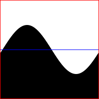
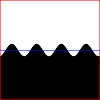

# bayoro-noise
Bayoro noise is a type of noise alternative to perlin, simplex and value noise.
The main difference is that the noise is calculated *in situ* meaning no other points are calculated except the point you want to get height in.

For now, the noise can't be looped in dimensions higher than 1D.


- [License](#License)
- [Theory](#theory)
	- [1D](#theory-1d)
	- [2D](#theory-2d)
- [Implementation](#implementation)
	- [JavaScript](#javascript)
		- [1D](#javascript-1d)
		- [2D](#javascript-2d)

## License
This is free and unencumbered software released into the public domain.

Anyone is free to copy, modify, publish, use, compile, sell, or
distribute this software, either in source code form or as a compiled
binary, for any purpose, commercial or non-commercial, and by any
means.

In jurisdictions that recognize copyright laws, the author or authors
of this software dedicate any and all copyright interest in the
software to the public domain. We make this dedication for the benefit
of the public at large and to the detriment of our heirs and
successors. We intend this dedication to be an overt act of
relinquishment in perpetuity of all present and future rights to this
software under copyright law.

THE SOFTWARE IS PROVIDED "AS IS", WITHOUT WARRANTY OF ANY KIND,
EXPRESS OR IMPLIED, INCLUDING BUT NOT LIMITED TO THE WARRANTIES OF
MERCHANTABILITY, FITNESS FOR A PARTICULAR PURPOSE AND NONINFRINGEMENT.
IN NO EVENT SHALL THE AUTHORS BE LIABLE FOR ANY CLAIM, DAMAGES OR
OTHER LIABILITY, WHETHER IN AN ACTION OF CONTRACT, TORT OR OTHERWISE,
ARISING FROM, OUT OF OR IN CONNECTION WITH THE SOFTWARE OR THE USE OR
OTHER DEALINGS IN THE SOFTWARE.

For more information, please refer to <http://unlicense.org/>

## Theory
The algorithm basically calculates a sum of scaled, rotated and shifted sinuses (called *coefficients* throughout the documentation), that are divided into layers.

Inspired by [the Weierstrass function](https://en.wikipedia.org/wiki/Weierstrass_function) and [the Fourier transform](https://en.wikipedia.org/wiki/Fourier_transform).
### 1D
Formula:


Visual example:
|Layer 0|Layer 1|Layer 2|Sum|
|-------|-------|-------|---|
|||||


Pseudocode example:
```
let coefficients=[
	{
		shift: 2*PI*random(), // shift is a random number between <0;2*PI)
		amplitude: 1, // sinus' amplitude, should decrease geometrically with each layer
		frequency: 1 // sinus' frequency, should increase geometrically with each layer
	},
	{
		shift: 2*PI*random(),
		amplitude: 0.5,
		frequency: 2
	},
	{
		shift: 2*PI*random(),
		amplitude: 0.25,
		frequency: 4
	},
];

function noise(x) {
	let sum=0; // variable to store height
	// iterate over all coefficients
	for (let i=0; i<n; ++i) {
		let coef=coefficients[i];
		sum+=coef.amplitude*sin(coef.shift+x*coef.frequency);
	}
	return sum;
}
```
### 2D

